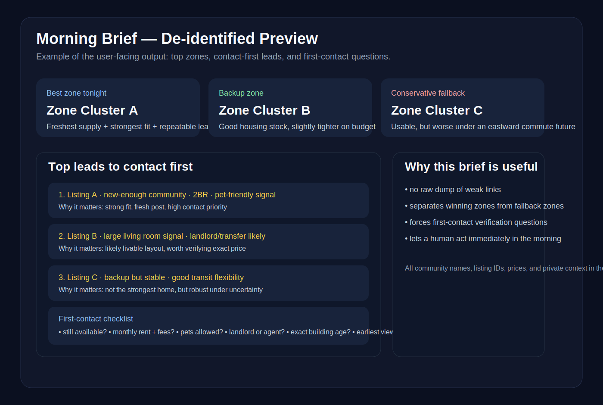
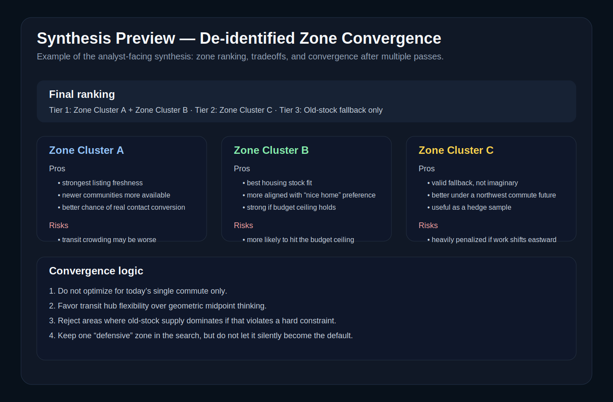

# City Rental Hunt

A reusable agent skill for hunting rental listings from Chinese social platforms — especially Xiaohongshu via TikHub, with Douyin as a supplement — and turning noisy social posts into a decision-oriented shortlist.

This skill was extracted from a real multi-zone apartment hunt and then **de-identified for public release**. It focuses on the part most people struggle with: not “how to search the web,” but **how to search, compare, filter, and converge** when listings are fragmented, social-first, and full of junk.

## What this skill does

City Rental Hunt helps an agent go from a fuzzy request like:

> “Find a two-bedroom rental in a few candidate zones, avoid old communities, keep commute flexibility, and give me only the most actionable leads.”

…to a structured workflow:

1. normalize constraints
2. split the city into search zones
3. generate short high-signal search keywords
4. search Xiaohongshu first, then Douyin if needed
5. extract listing facts from noisy posts
6. filter weak / stale / misleading leads
7. produce a shortlist and a contact-first brief

It is optimized for the reality of apartment hunting on Chinese social platforms:
- many listings are semi-structured, not marketplace-grade
- location descriptions are vague
- prices are often missing or partial
- landlord vs agent is ambiguous
- “good post” and “good lead” are not the same thing

## Who this is for

Use this skill when you need to:
- hunt rentals across several candidate neighborhoods
- compare zones under commute / budget / room-count constraints
- find currently listed rentals rather than generic “which area is good” advice
- triage Xiaohongshu / Douyin rental posts into something actionable
- build a user-facing morning brief from a messy overnight search run

It is especially useful when:
- the target city is large
- the user is balancing **multiple possible commute futures**, not just today’s office
- “newer community / elevator / pet policy / landlord-direct / room layout” matters as much as raw price

## Core idea

The core insight behind this skill is simple:

> **Zone strategy beats giant keyword search.**

Most rental hunts fail because people search with one long natural-language query and drown in junk. This skill does the opposite:
- split by zone first
- search short phrases
- promote repeated neighborhoods into dedicated buckets
- score leads by freshness, fit, contactability, and red flags

That turns “social noise” into a usable search system.

## Workflow

### 1) Normalize the requirement brief

The skill first turns fuzzy user intent into a compact internal schema like:

```yaml
city: 北京
zones: [候选区A, 候选区B, 候选区C]
budget: 预算区间
rooms: 两居
must_have:
  - 整租
  - 电梯
  - 次新 / 不要老小区
soft_preferences:
  - 客厅大
  - 房东直租
  - 宠物友好
vetoes:
  - 老小区
  - 合租
  - 商住
  - 非民水民电
```

The point is not to over-model. The point is to make downstream search consistent.

### 2) Build zone-aware keyword buckets

Instead of one bloated query, the skill builds search buckets for each zone:
- broad: `<zone> 整租 两居`
- quality: `<zone> 次新 电梯 两居`
- conversion: `<zone> 房东直租 两居` / `<zone> 转租 两居` / `<zone> 可养猫`

If a neighborhood keeps appearing, it gets promoted into its own bucket.

### 3) Search Xiaohongshu first

The skill assumes TikHub is the primary retrieval path.

Why Xiaohongshu first?
- high density of fresh rental posts
- many transfer / landlord / “just moved out” signals
- strong neighborhood-level search value
- usually better first-pass supply discovery than general web search

### 4) Use Douyin only as a supplement

Douyin is useful when you need:
- walk-through videos
- very fresh transfer leads
- an extra pass in zones where Xiaohongshu is thin

But it should not dominate the run unless the city’s supply pattern justifies it.

### 5) Extract facts, not vibes

For every candidate lead, the skill wants evidence like:
- platform
- post id / URL
- title / summary
- price if present
- neighborhood / zone / transit hint
- freshness
- landlord / transfer / agent / unclear
- pet signal if present
- keep / maybe / discard classification
- reason

### 6) Produce two outputs

#### A. Analyst-facing search record
This is the full working sheet:
- keywords used
- candidates found
- reasoning for keep / maybe / discard
- repeated neighborhoods worth deeper follow-up
- risk notes

#### B. User-facing morning brief
This is what the human should actually read:
- which zones won
- top leads to contact first
- why they matter
- what to verify on first contact

## Example outputs (de-identified)

### De-identified morning brief preview



### De-identified synthesis preview



These previews are **reconstructed from a real run** but intentionally scrubbed:
- no personal names
- no private commute addresses
- no real listing ids
- no public release of private room-by-room judgments
- no exact private shortlist copied verbatim

The goal is to show the **shape and usefulness of the output**, not leak the original search.

## Repository structure

```text
city-rental-hunt/
├── README.md
└── city-rental-hunt/
    ├── SKILL.md
    ├── references/
    │   └── playbook.md
    └── scripts/
        └── keyword_plan.py
```

## Files

### `city-rental-hunt/SKILL.md`
The public skill definition.

Covers:
- when to use the skill
- end-to-end workflow
- scoring heuristics
- output format
- privacy boundaries

### `city-rental-hunt/references/playbook.md`
The operational playbook.

Includes:
- constraint normalization schema
- keyword building patterns
- evidence schema
- red-flag checklist
- freshness tiers
- shortlist logic
- privacy / de-identification rules

### `city-rental-hunt/scripts/keyword_plan.py`
A small helper that generates reusable search phrases by zone.

## Quick start

Run the keyword planner:

```bash
python3 city-rental-hunt/scripts/keyword_plan.py \
  --city 北京 \
  --zones "北苑,霍营,清河" \
  --budget "6000-9000" \
  --rooms "两居" \
  --must "整租,电梯,次新" \
  --optional "房东直租,转租,可养猫"
```

Example output:

```text
## 北苑
- 北苑 整租 两居
- 北苑 两居 房东直租
- 北苑 两居 转租
- 北苑 整租 电梯 两居
- 北苑 房东直租 两居
- 北苑 转租 两居
- 北苑 可养猫 两居
```

## Recommended operating pattern

For a serious search run, use this pattern:

1. define 2–4 candidate zones
2. generate keywords per zone
3. search Xiaohongshu with short phrases
4. create a candidate pool
5. classify every lead into keep / maybe / discard
6. identify repeated neighborhoods
7. build a contact-first order
8. write a concise user brief

If the run spans multiple zones, splitting into per-zone workers usually produces cleaner results than one giant mixed search.

## What this skill is intentionally not

This is **not**:
- a scraping framework
- a generic real-estate crawler
- a map-routing optimizer
- a recommendation engine that guesses where someone “should live” without evidence

It is a practical search-and-triage layer for social listings.

## Privacy and release notes

This public release is based on a real private apartment-hunting workflow, but the release version is deliberately de-identified.

Removed or abstracted:
- personal identities
- exact private commute pairings
- private listing IDs used in the original run
- direct reproduction of the original final shortlist
- any details that would expose a specific household’s search footprint

Kept:
- the search method
- the zone comparison framework
- the evidence schema
- the lead triage logic
- the reporting structure

## Publishing

- **ClawdHub**: published as `city-rental-hunt`
- **SkillHub**: expected to index this public GitHub repo automatically

## Why this skill exists

A lot of “apartment advice” is too abstract, and a lot of “rental scraping” is too mechanical.

This skill lives in the useful middle:
- concrete enough to produce leads
- structured enough to compare zones
- skeptical enough to reject junk
- concise enough to hand a human a real decision brief

If you care about finding a livable shortlist instead of just collecting links, this is the layer that matters.
